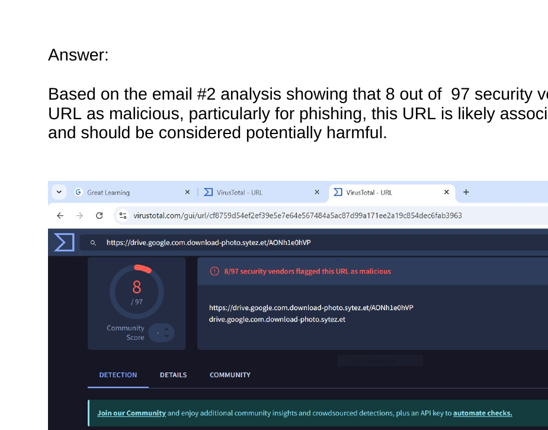
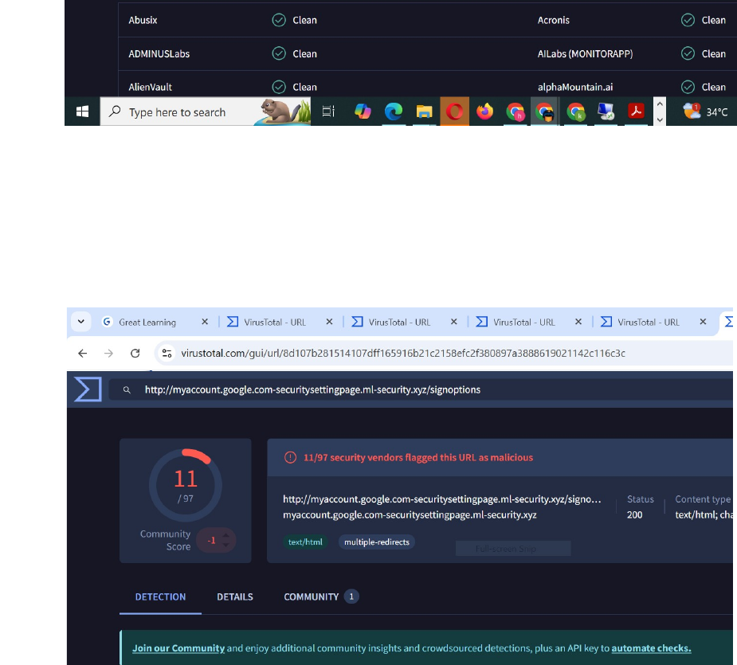
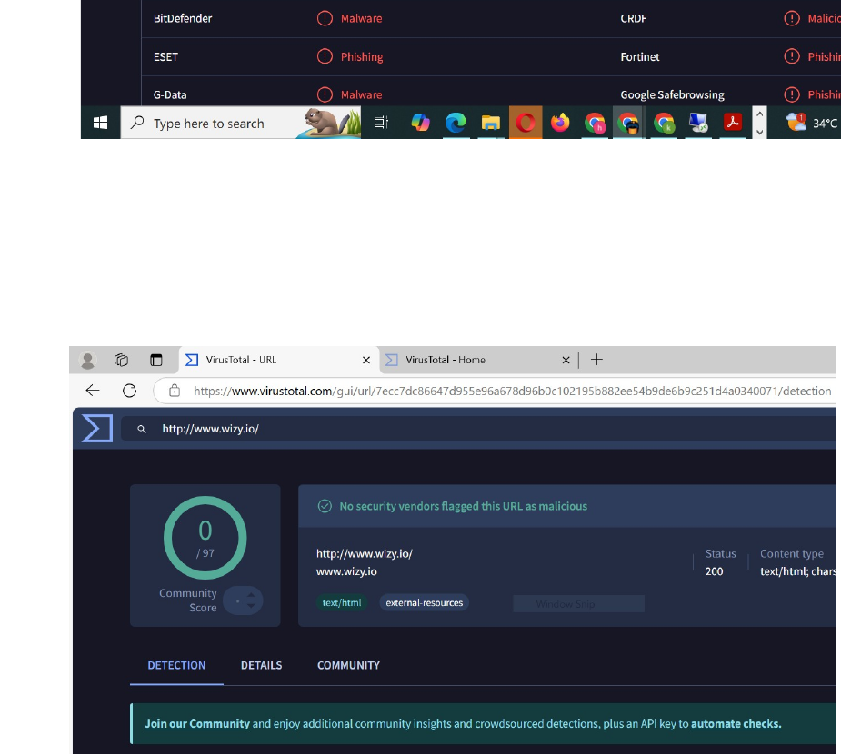
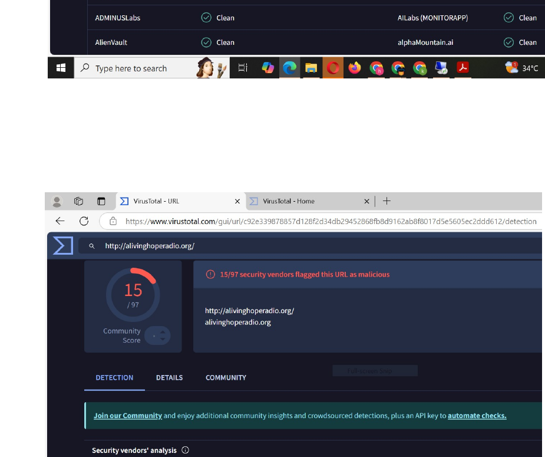

# Phishing Email & Malicious URL Analysis

**Project completed:** 2025  
**Published to GitHub portfolio:** 2026

## 🔎 Project Overview

This project demonstrates practical phishing investigation and malicious-URL analysis using VirusTotal.

The assessment involved reviewing suspicious email-related URLs and standalone URLs, comparing security-vendor detections, identifying potentially malicious indicators, and documenting conclusions based on the available evidence.

---

## 🎯 Project Objectives

- Analyze suspicious email URLs
- Identify potential phishing indicators
- Evaluate VirusTotal security-vendor detections
- Distinguish malicious URLs from clean URLs
- Assess phishing risk based on multiple security-engine results
- Document investigation findings
- Apply evidence-based security analysis

---

## 📧 Email Analysis

Five email-related URLs were assessed using VirusTotal.

The analysis included both clean and suspicious results.

Examples included:

- Email #1 — assessed as not phishing based on clean vendor results
- Email #2 — identified as potentially phishing based on multiple malicious detections
- Email #3 — assessed as not phishing
- Email #4 — assessed as not phishing
- Email #5 — identified as a high-risk phishing attempt

---

## 🌐 URL Analysis

Five standalone URLs were also evaluated.

The assessment included:

- Clean URLs with no significant malicious detections
- Suspicious URLs flagged by multiple security vendors
- Phishing-related detections
- Malicious-URL classification
- Comparison of vendor verdicts

---

## 🛡️ Analysis Method

The investigation used VirusTotal to compare results across multiple security vendors.

Key factors considered included:

- Number of malicious detections
- Phishing classifications
- Clean vendor verdicts
- Consistency across security engines
- Overall risk level

---

## ⚠️ Key Findings

The project demonstrated that a URL should not be classified based on a single indicator.

A stronger assessment considers:

- Multiple vendor detections
- Phishing labels
- Malicious classifications
- Reputation data
- Consistency of results

URLs flagged by several independent vendors were treated as higher-risk indicators requiring caution and further investigation.

---

## 🧠 Skills Demonstrated

- Phishing Analysis
- Malicious URL Investigation
- VirusTotal
- Threat Intelligence
- Security Analysis
- Indicator Assessment
- Threat Detection
- SOC Investigation
- Cybersecurity Decision-Making
- Evidence-Based Analysis

---

## 📈 Key Takeaways

This project strengthened my ability to investigate suspicious links and evaluate security-vendor evidence before making a determination.

It also reinforced the importance of using multiple indicators and security-engine results rather than relying on a single detection source.

---
## 📸 Project Screenshots

### 1. Email #2 — Phishing Analysis

### 2. Email #5 — High-Risk Phishing

### 3. Clean URL Analysis

### 4. Malicious URL Analysis

---

## 📄 Project Evidence

Selected screenshots from the completed phishing email and malicious-URL analysis are included in this repository as supporting evidence.

[📄 View Phishing Email Analysis Submission](Phishing%20Email%20Analysis%20Submission.docx) 

The screenshots demonstrate both clean and malicious VirusTotal verdicts and the reasoning used to classify suspicious links.

---

## 👨‍💻 Author

**Benard Obi Kekong**

Cybersecurity Analyst | CompTIA Security+ | SOC & GRC | Microsoft Sentinel | SIEM | Risk Assessment | Python
